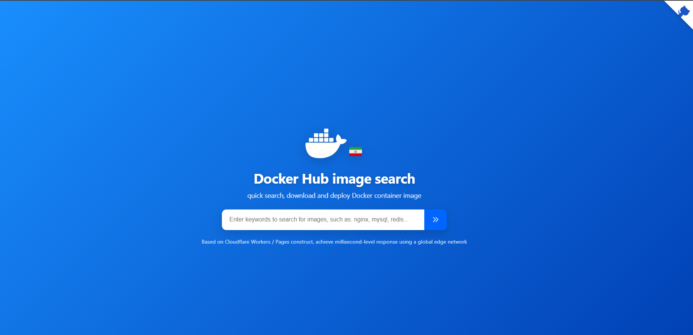

# 🐳 Docker Personal Proxy Tool / ابزاری برای راه اندازی پروکسی شخصی داکر!



## English

This project is a tool for setting up a Docker image proxy on Cloudflare Workers platform.

> [!WARNING]
> Please note that setting up VPN and any kind of proxy on Cloudflare platform violates Cloudflare's terms of service.
> Please consider this issue when using and do not deploy this service on your main accounts.

### 🚀 Deployment and Implementation

- **Workers**: Deploy the contents of the `worker.js` file in your Worker
- **Pages**: Fork this project for yourself and easily deploy by connecting your account to Cloudflare

Assume your Worker app domain is: `myapp.account.workers.dev`

#### 1. Add your Worker domain to the beginning of the image name

```shell
docker pull myapp.account.workers.dev/grafana/grafana:12.0.1
```

```shell
docker pull docker.fxxk.dedyn.io/library/nginx:stable-alpine3.19-perl
```

#### 2. Set up Docker mirror configuration

Create the `/etc/docker/daemon.json` file if it doesn't exist and set your mirror there:

```shell
sudo tee /etc/docker/daemon.json <<-'EOF'
{
  "registry-mirrors": ["https://myapp.account.workers.dev"]
}
EOF
sudo systemctl restart docker
```

---

### Original Repo -> https://github.com/cmliu/CF-Workers-docker.io
